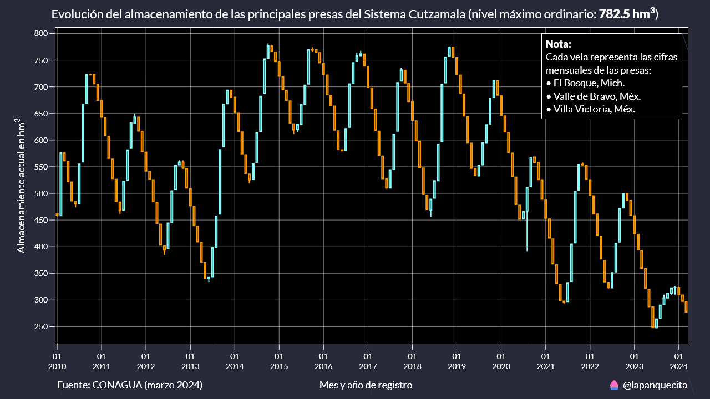
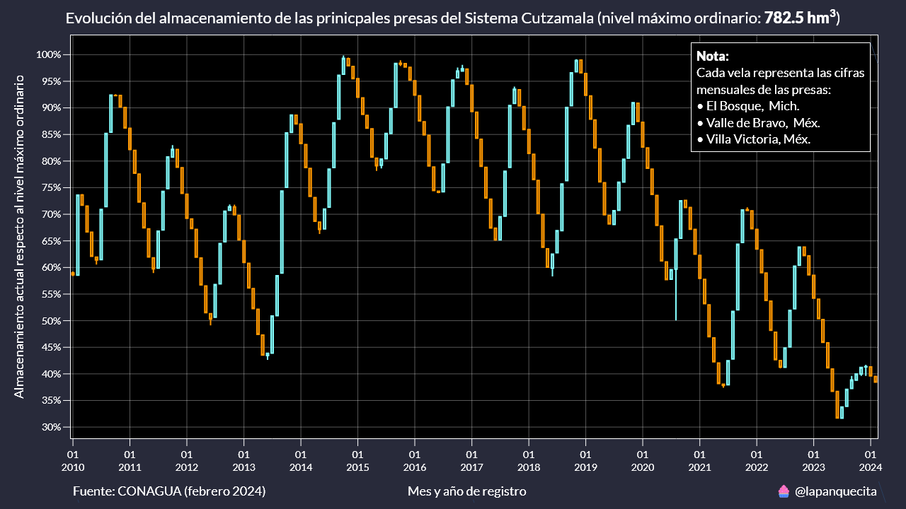

# Monitoreo de las presas de México

En este repositorio se encuentran series de tiempo y scripts para analizar el nivel de llenado de las principales presas de México utilizando los datos oficiales de la CONAGUA.

La CONAGUA dispone de un servicio web con la información histórica del nivel de llenado de las principales presas de México. Con un sencillo web scraper es posible descargar esta información y consolidarla de forma anual.

https://sinav30.conagua.gob.mx:8080/Presas/

## Contenido

* `downloader.py`: Este script tiene tres funcionalidades.

    La primera es descargar todos los archivos JSON del año especificado. 

    La segunda es consolidarlos en un archivo CSV anual.
    
    La tercera es crear un diccionario con los metadaos de las presas.

* `velas_individual.py`: Este script crea gráficas de velas para una presa especificada.

* `velas_multiples.py`: Este script crea gráficas de velas para un conjunto de presas especificadas.

## Gráficas de velas
   
El nivel de llenado de las presas se mide en hectómetros cúbicos y varía muy poco de día a día.

Por esa razón me pareció buena idea usar gráficas de velas para representar este valor de manera mensual.

La gráfica de velas se encuentra en dos versiones: cifras absolutas y porcentajes respecto al nivel de aguas máximo ordinario (NAMO).

De esta manera es más fácil detectar cuando el nivel se encuentra en niveles de preocupación.

## Conclusión

Con el paso de los meses iré agregando más formas de visualizar esta niformación.

Por lo mientras es importante tener un lugar que sirva de acervo en caso de que el servicio web vuelva a fallar.
